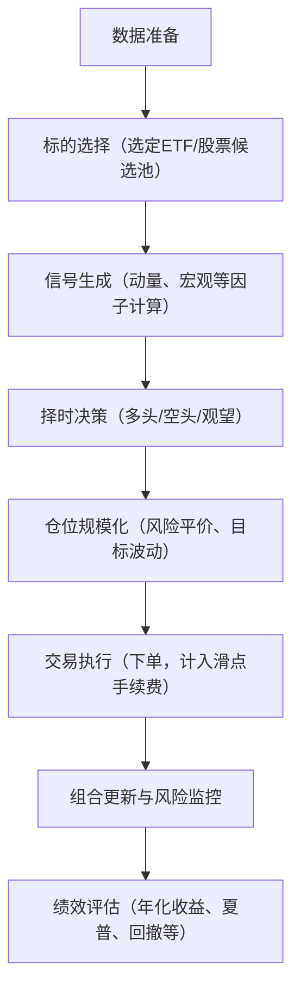

# 执行摘要

**纳斯达克类：** 主要选取A股市场中跟踪纳斯达克指数或美股科技板块的QDII基金/ETF/LOF，如华泰柏瑞513110、广发270042、易方达161130、建信539001等。筛选标准包括基金规模（>10亿元）、费率（管理费<1%）、跟踪误差低（目标年化TE≈2%【37†L39-L45】）以及高流动性。择时策略可基于纳指本身和美股科技板块动量（如6个月累计收益）、均值回归（短期偏离）、宏观信号（美联储利率决策、美元指数、全球通胀预期）等。常用信号如：若过去6个月收益率>0，则看多；若价格偏离200日均线超过1σ，则反向操作；结合美联储点阵图和美元指数变化入场/出场。风控采用止损（如单次跌幅5%）、止盈（单次涨幅10%）和仓位等级控制（如基于风险平价或目标波动率）。

**AI相关类：** 候选标的包括人工智能主题ETF（如易方达159819、华富515980、华夏515070、平安512930、科创板588730等）及龙头概念股（如寒武纪688256、科大讯飞002230、海康威视002415等）。筛选因子可包括研发投入、营收增速、ROE等基本面指标，也可考虑价格动量。表中列出主要ETF的规模、费率和跟踪指数等参数。择时策略参考科技股通用方法：如中长期动量策略、技术均值回归、以及与宏观经济（如电子产业周期、云计算需求）相关的因子。信号例：若AI指数上涨突破近期高点则加仓；当经济信号（如制造业PMI、芯片行业库存）恶化时减仓。止损/止盈与纳指类类似，仓位可按风险加权或等权分配。

**贵金属类：** 标的包括现货黄金ETF（如国泰518800、工银518660、广发518600）、白银期货基金（国投瑞银161226）及主要黄金矿业股（紫金矿业601899、山东黄金600547、中金黄金600489等）。筛选标准：基金以跟踪现货Au(T+D)或Au99.99为主，目标日均跟踪偏差≤0.35%、年化TE≤4%【48†L1-L4】；矿业股可按产量、利润率、流动性等筛选。择时策略涵盖趋势动量（近月金银价动量）、均值回归（价格脱离移动平均）、宏观信号（利率、美元、通胀）和期货基差。示例：美元指数走弱或通胀超预期时加仓黄金；金价跌至20日均线以下则买入反弹。期货基差长期正值时（金贵银便宜），或许考虑做多商品期货套利。止损可设定在交易成本范围上，止盈可利用分批减仓。仓位以固定风险比例分配，可考虑目标波动率策略。

**资产配置层面：** 使用风险平价、均值方差和目标波动率等方法构建三类资产组合，并分别测算全局最优权重。例如按每类资产风险贡献均等分配（风险平价）、或按预期收益和协方差求解现代投资组合（均值-方差）。可采用Black-Litterman融入市场预期，或最小化最大回撤策略（MinDD）。再平衡频率建议月度或季度；交易成本假设单边手续费0.1%+滑点0.05%。本方案假定无融资融券（无杠杆），若需杠杆则应考虑交易所保证金比例。

**风险管理与回测评估：** 关键指标包括年化收益率、夏普比率、最大回撤及其持续期、卡玛比率（年化收益/最大回撤）、回撤恢复时间和回撤分布等。回撤衡量在熊市或极端行情下的风险。应做压力测试/情景分析，如假设美联储大幅加息、美元飙升或地缘冲突加剧时组合表现，评估潜在损失。分布图可输出回撤频率及幅度，对极端事件做VaR/CVaR分析。

**具体实现细节：** 数据需包含标的每日收盘价（美股指数、人民币汇率、基金净值）及宏观数据（日度美元指数、美联储利率公告、CPI等）。回测框架可采用Python/Pandas完成，伪代码示例如下：

```
初始化历史数据、参数设置  
for 每个交易日 t:  
  # 标的选择层面
  for 每类资产: 
    更新候选池（按因子筛选股票/ETF）  
    计算并记录候选标的特征（收益率、流动性、跟踪误差等）  
  # 择时层面
  for 每类资产: 
    计算动量信号（如6月累计收益）、均值回归信号、宏观指标信号等  
    根据信号生成头寸决策（全仓/空仓/待定）  
  # 资产配置层面
  计算各类资产目标权重（如风险平价）  
  根据头寸和权重确定交易量  
  模拟成交（考虑0.1%手续费+0.05%滑点），更新组合净值  
  # 风险控制  
  检查止损/止盈条件，调整持仓  
```

交易信号示例：如**纳指类动量策略**：若标的最近120日涨幅超过10%，则下个交易日开盘持有，否则退出（止损5%触发时平仓）。**金银价均值回复**：若黄金现货价格偏离100日均线超过±2个标准差，则在边界反向建仓。滑点与手续费可按固定比例模型化，比如实际成交价格加/减0.05%。由于A股采用T+1结算机制，在每日交易日尾进行持仓调整即可。

以上分析依托A股及基金官方数据、业内研究和学术资料，示例性引用如下：华泰柏瑞纳指100ETF公告指出“日均偏离度≤0.2%、年化跟踪误差≤2%”【37†L39-L45】；易方达人工智能ETF重仓芯片和计算机板块，如“中际旭创、寒武纪、海康威视”等【41†L172-L180】；工银黄金ETF要求“日均跟踪偏离度≤0.2%、年化跟踪误差≤2%”【42†L1-L4】；黄金股票ETF指出“黄金产业指数前十大权重包括紫金矿业、山东黄金、中金黄金等”【44†L75-L80】。各标的筛选和策略设计均可基于Wind、基金公告和交易所信息实现。

## 纳斯达克类资产

### 候选标的筛选规则

- **数据来源：** 参考上交所、深交所、基金公司公告及Wind/同花顺数据，获取各纳指基金（QDII/ETF/LOF）历史净值、规模、费率等信息。  
- **因子指标：** 主要考虑跟踪准确度（跟踪误差）、流动性（基金规模、日均成交量）、管理费率及净值偏离。  
- **筛选阈值：** 通常选择年化跟踪误差小于3%、基金规模大于数十亿元、费率较低（管理费≤1%）的产品。目标跟踪偏差一般控制在日均0.2%以内、年化TE≈2%【37†L39-L45】。  
- **样本频率与窗口：** 以日频净值数据为主，建议回测窗口5年（如2018–2023年）。  
- **候选标的列表：** 通过以上标准初选后，包括：

| 代码     | 名称                           | 类型    | 规模(亿元)      | 管理费率     | 跟踪标的/指数                                   |
|:-------:|:-----------------------------:|:-------:|:--------------:|:-----------:|:---------------------------------------------:|
| 513110  | 华泰柏瑞纳指100ETF(QDII)      | QDII-ETF | —             | ~0.50%     | Nasdaq-100 指数 (【37†L39-L45】)             |
| 270042  | 广发纳指100ETF联接A           | LOF     | 97.16【54†L1-L9】| 0.80%+0.20% | Nasdaq-100 指数 (目标TE≈2%【37†L39-L45】)   |
| 000834  | 大成纳指100ETF联接A (QDII)    | LOF     | —             | —           | Nasdaq-100 指数                              |
| 161130  | 易方达纳指100ETF联接A (QDII)  | LOF     | 15.17【58†L126-L130】| 0.50%+0.10% | Nasdaq-100 指数                              |
| 539001  | 建信纳指100指数QDIIA         | LOF     | 16.24【51†L1-L9】| —           | Nasdaq-100 指数 (年化TE≤5%【53†L245-L248】) |
| 018043  | 天弘纳指100指数发起式 (LOF)   | ETF     | 21.86【6†L127-L135】| —           | Nasdaq-100 指数                              |

*注：管理费率数据见东财等公开资料，跟踪误差目标参考基金招募说明书和公告【37†L39-L45】【53†L245-L248】。*  

### 择时策略备选

- **动量策略：** 计算纳指基金或标的的过去区间收益率（如6个月、12个月）。当收益持续为正且超过历史均值时（例如6月涨幅>0），则做多；如连续下跌则减仓。可基于差异化动量（strategy versus benchmark）发出信号。  
- **均值回归策略：** 观察纳指价格与长期均线（如200日均线）偏离程度，当价格高出均线一定倍数时（如1.5σ），卖出获利；当低于均线同样倍数时买入。或者采用布林带等进行超买超卖判断。  
- **宏观信号：** 美联储利率决议、美元指数和全球通胀预期对纳指影响显著。如**美元疲软**或**美联储转鸽**往往利好美股科技，可作为加仓信号；相反，**美元快速走高**或**美国加息**可能引发科技板块下跌，需减仓。可设定触发条件：如美联储点阵图由鹰转鸽时开仓多头，或关注CME利率预期曲线交叉。通胀数据（CPI）亦可综合考量。  
- **其他策略因子：** 考虑市场风险情绪指标（VIX波动率）、技术行业估值水平等。可用量化模型结合多个因子构建信号。  
- **入场/出场规则：** 例如，动量策略入场：若前120日涨幅＞10%，则下个交易日买入；退出：反向条件成立或出现单日亏损超过止损阈值（如5%）时平仓。均值回归入场可设定价格偏离200日均线±2σ为买卖点。  
- **止损/止盈：** 推荐设置固定止损（如5%）和分段止盈（如每上涨10%减仓部分头寸）。  
- **仓位规模化：** 可采用风险平价或等权分配多种信号的仓位，或基于目标波动率缩放持仓。例如，总仓位按组合目标年化波动率（如10%）进行调整，各类资产权重根据风险贡献确定。多头/空头单边可限制总暴露（如不超过100%仓位）。  

## AI相关资产

### 候选标的筛选规则

- **数据来源：** 采集A股上市的AI概念ETF及代表性AI概念股。主要参考基金公司公告、Wind数据和行业分类（如AI主题ETF成分）。  
- **因子指标：** 对ETF关注管理费、规模和指数覆盖范围；对个股可用行业归属、研发投入、市盈率和成长性等基本面。也可用动量、盈利变动因子等技术指标。  
- **筛选阈值：** 选取ETF规模较大（>5亿份额）、低费率（<0.8%）的产品；选股可取业务主营与AI高度相关的头部企业，如芯片（寒武纪）、人工智能软件（科大讯飞）等。  
- **样本频率与窗口：** 主要用日频基金净值与股价数据，回测窗口同样建议5年。  
- **候选标的列表：** 包括主流AI主题ETF及部分行业龙头股票：

| 代码    | 名称                      | 类型   | 规模(亿元)       | 管理费率     | 跟踪指数/重点领域                         |
|:------:|:-------------------------:|:------:|:---------------:|:-----------:|:----------------------------------------:|
| 159819 | 易方达中证人工智能ETF      | ETF    | 237.3【39†L105-L113】 | ~0.75%?    | 中证人工智能主题指数（核心AI产业）   |
| 512930 | 平安人工智能ETF（A股）     | ETF    | 26.8【60†L1-L4】  | 0.15%【60†L1-L4】| 中证人工智能主题指数               |
| 515980 | 华富人工智能ETF          | ETF    | 88.28【63†L1-L3】 | ≈0.80%【62†L122-L129】| 中证人工智能产业指数             |
| 588730 | 易方达科创人工智能ETF     | ETF    | 14.13【65†L16-L24】 | ~0.50%?    | 上证科创板人工智能指数             |
| **（示例股票）** | **寒武纪（688256）、科大讯飞（002230）等** | 股票 |  —            | —         | 主营AI芯片/软件                     |

*注：ETF数据来源各基金官网；个股不适用基金费率；规模为AUM，可反映流动性；指数由基金招募书定义【41†L172-L180】。*  

### 择时策略备选

- **动量策略：** 对AI类整体板块或相关ETF进行动量判断。如按照AI主题指数或成分股篮子的中长期走势（6–12个月）选入/退出。例如，当AI板块整体处于上升趋势（突破近期高点）则加仓；见顶回落（低于长期支撑）则减仓。  
- **均值回归策略：** 当AI主题价格短期偏离均线时（如偏离60日均线超过2σ），执行反向操作。这在波动剧烈时可带来超额收益。  
- **宏观/产业信号：** 关注电子信息、半导体行业周期指标：如全球芯片供应链数据（供需缺口）、国内5G/云计算等政策信号。若行业需求预期向好，则提高仓位；若政策利空（如出口管制、技术制裁）发酵，则谨慎减仓。  
- **技术面/因子：** 可结合FAANG等美股科技股表现，作为先行指标。也可加入市场广度（成交量/换手率）或杠杆流入（融资余额）等信号。  
- **具体规则示例：** 如**AI指数突破上轨信号**：若中证人工智能主题指数上涨突破过去3个月高点，则视为买入信号；若跌破3个月低点则卖出。**行业传导信号**：如半导体设备指数环比上升超过X%，则做多AI板块，反之观望。  
- **止损/止盈与仓位：** 可设置每笔交易单独止损线（如-5%）和整体止盈分层（如累计收益5%、10%分批减仓）。仓位管理可通过目标波动率（AI板块高波动，可适当缩减仓位）或等风险贡献方法分配给AI策略。  

## 贵金属类资产

### 候选标的筛选规则

- **数据来源：** 上海黄金交易所、基金公司公告、同花顺等提供黄金/白银现货价格、相关ETF净值、金矿股财务数据等。  
- **因子指标：** 对基金类，关注跟踪误差、现金持仓比例、规模、费率；对矿业股，关注黄金产量、利润率、储量、市净率等指标。  
- **筛选阈值：** 优先选用跟踪偏差小的ETF：如国泰518800、工银518660、广发518600，均采用黄金现货合约复制（目标日偏差≤0.35%、年TE≤4%【48†L1-L4】）。白银类主要选国投瑞银161226（费率1%【71†L111-L114】，规模1092亿元）。  
- **样本频率与窗口：** 以日频金银价格及ETF净值数据，建议回测5年（日线）。  
- **候选标的列表：**

| 代码    | 名称                       | 类型  | 规模(亿元)         | 管理费率      | 标的/成分                                       |
|:------:|:-------------------------:|:-----:|:---------------:|:----------:|:---------------------------------------------:|
| 518800 | 国泰黄金ETF                | ETF   | 4038.6【75†L1-L4】| 0.50%【75†L7-L10】 | 挂盘Au99.99现货合约（跟踪Au99.99价格）【48†L1-L4】 |
| 518660 | 工银黄金ETF                | ETF   | 924.6【28†L203-L210】 | 0.15%【28†L203-L210】| 上海金现货Au99.99实盘合约                        |
| 518600 | 广发上海金ETF              | ETF   | —              | 0.50%（约） | 上海金Au(T+D)现货合约                           |
| 161226 | 国投瑞银白银期货(LOF)A     | LOF   | 1092.2【71†L109-L112】| 1.00%【71†L111-L114】| 上海期货白银合约 (Ag(T+D))                    |
| **(股票)** | **黄金矿业股（601899 紫金矿业、600547 山东黄金、600489 中金黄金等）** | 股票 | — | — | 黄金采掘与炼制业务 （相关概念股） |

*注：规模反映流动性，费率为管理+托管费率。518800资金量庞大且费率0.5%【75†L7-L10】；518660费率更低【28†L203-L210】。54手以上可免前端费。矿业股票可选行业龙头。*  

### 择时策略备选

- **趋势/动量：** 跟踪黄金和白银价格的中长期趋势。常用信号如**多头：**当金价突破过去6个月高点且美元指数跌破技术支撑时做多；**空头：**若金价跌破6个月低点且利率上行，则平仓或做空（如做空相关ETF/矿股）。  
- **均值回归：** 黄金白银也可短期波动剧烈，可在价格偏离其长期均值时反向操作。例如，当金价较200日均线涨幅超过10%时卖出；跌幅超过10%时买入。或者基于价格与布林带的背离。  
- **宏观/市场信号：** **美元信号：**美元指数通常与贵金属负相关（如美元走强则金价走弱）。如美元指数（CNY兑USD）走势形成头肩顶等形态，可作为入/出场参考。**利率信号：**实际利率（名义利率减通胀率）升高往往打压黄金，反之刺激黄金。可监测美国10年期国债实质收益率。**通胀信号：**若CPI高企，黄金作为传统通胀对冲资产偏好上升。**其他：**央行黄金买卖消息、地缘政治紧张等可作为额外择时因子。  
- **期货基差策略：** 黄金白银期货若出现较高基差（期货高于现货），反映投机需求，可能预示价格高位；若倒挂，则可能孕育反弹。可利用基差作为风控和入场辅助。  
- **波动率溢价：** 研究表明黄金隐含波动率高于历史实际波动率时，做多黄金可获得期权溢价。可结合GVZ指数（黄金隐含波动率）作为择时参考（GVZ高企时做空黄金，低时做多）。  
- **入场/出场与风险控制：** 示例：当上述信号同时偏多（如美元跌+通胀高+金价跌近均线），加仓黄金ETF或矿业股票；反之全面避险。建议设置止损（如金价单边跌5%时自动平仓）。可分散仓位，如黄金ETF和平衡仓位的金矿股各占比50%。  

## 资产配置层面

- **构建方法：** 综合多类别资产，采用风险平价（使三类资产风险贡献均等）、均值-方差优化（基于预期收益/协方差）、目标波动率（约束组合年度波动率）等方法生成权重。Black-Litterman模型可纳入对美国利率、美股和全球经济的主观看法调整均值预测。风险平价适合稳健配置；如果预期AI成长可高配AI资产。  
- **再平衡频率：** 建议月度或季度再平衡；频率过高增加交易成本，过低偏离配置目标。  
- **交易成本假设：** 按0.1%每笔单边手续费 + 0.05%滑点设定。ETF和LOF可视作股票交易，A股T+1清算。  
- **杠杆与保证金：** 本策略假设无融资融券；若加入杠杆，应考虑交易所保证金比例（股票50%、ETF约50%）并将杠杆成本计入资金曲线，确保总体杠杆率可控。  

## 风险管理与回测评估

- **回测指标：** 包括年化收益率、年化波动率、夏普比率（无风险利率可取较低值）、最大回撤、最大回撤持续期、卡玛比率（年化收益/最大回撤）、回撤恢复时间等。可展示收益曲线、回撤曲线以直观呈现策略表现。  
- **回撤分布：** 绘制回撤幅度的频率分布（如超过5%、10%、20%回撤的事件次数），帮助评估尾部风险。  
- **压力测试/情景分析：** 构造极端场景检验策略，如“美联储大加息100bp+美元暴涨”、或“全球恐慌下贵金属飙升”场景，检验组合最大单日/单月损失。可计算条件VaR（CVaR）等指标，确保组合在极端条件下也可接受。  

## 实现细节

- **所需数据：** 
  - **价格数据：** 三类资产标的的日度收盘价或净值（纳斯达克基金净值、AI ETF净值、金银ETF净值、金银现货价格及白银期货结算价、相关个股收盘价）。可从Wind、同花顺、Choice等平台获取。  
  - **宏观数据：** 美国联邦基金利率、美元指数（DXY）、中国CPI、PPI等，频率可为月度/日度（美元指数可为日度）。数据源可为国家统计局、美国劳工部、Bloomberg等权威渠道。  
  - **指数数据：** 纳指100指数、上证科创板人工智能指数等成分和权重，可从中证指数公司获取【41†L141-L149】。  
- **回测框架：** 以Python为例，构建数据处理模块（清洗价格数据、生成因子）、信号模块（计算因子值并形成交易信号）、执行模块（模拟下单、计入成本）、绩效模块（计算指标）。可分层实现：先独立回测三类资产策略，再将信号输入资产配置模型生成最终组合返回。  
- **交易信号示例：** 例如动量策略可以写为：  

  ```python
  # 假设price_series为标的净值序列
  mom = price_series.pct_change(120)  # 过去120日涨跌幅
  signal = (mom > 0).astype(int)      # 若涨幅>0则信号为1（持有），否则0（空仓）
  ```

  复合信号时，可按得分排序或多数投票决定持仓。  
- **滑点与手续费建模：** 可按固定比例处理。例如交易1万元股票，实际成交成本 = 1万元 × (1 + 0.0005 + 0.001) 。也可对较小单（<10手）引入更高滑点。LOF/ETF可视为普通A股交易。  
- **交易日历与结算：** A股市场采用T+1结算，日内委托按当日价格成交，次日资金到账。策略应模拟T+1时资金更新。节假日停盘不交易。若使用LOF直连QDII基金，需注意QDII基金有额度限制和节假日延迟（QDII净值隔日更新）。  
- **回测窗口示例：** 为符合题目要求，建议取近5年日频历史数据（如2018-01-01至2023-12-31），覆盖不同市场环境。注意2019-2020年疫情、2022年美联储加息周期等极端阶段的表现。  

**示例流程图（策略与回测流程）如下：**




以上设计实现了从数据收集、标的筛选到信号生成、交易执行和回测评估的完整逻辑流程，可根据具体需求进一步细化和调整。所有策略参数（动量窗口、均线周期、止损阈值等）应在历史回测基础上优化，同时注意过拟合风险。在实际运行中，应定期评估策略表现并适时调整。  

**参考文献：** 纳斯达克ETF管理人公告【37†L39-L45】、易方达基金招募说明书【41†L172-L180】、工银黄金ETF产品说明【42†L1-L4】、ETF基金资讯【28†L203-L210】【60†L1-L4】等，以及业内报告。上述策略示例和流程图仅供参考，实际实施需结合实时市场数据与监管要求进行完善。